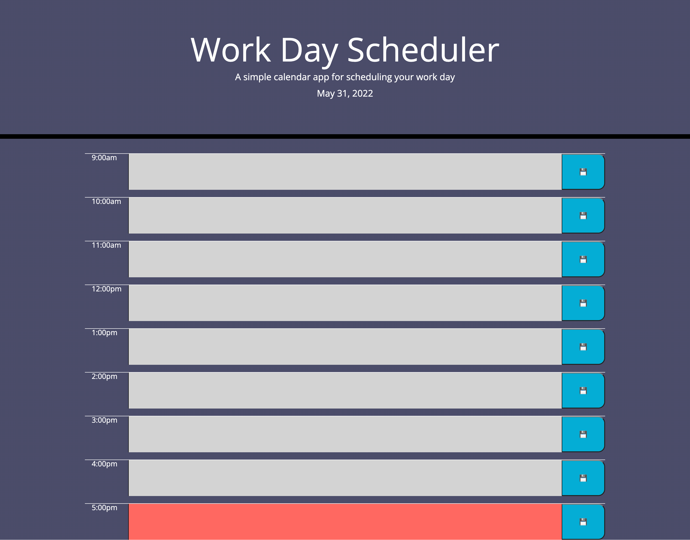

# Work-Day-Scheduler

## Table of Contents
1. [Description](#discription)
2. [Respository](#respository)
3. [Visuals](#visuals)

## Description
Used Jquery, Moment JS along with HMTL and Bootstrap to make a Work-Day-Scheduler

- Started with building out the hmtl and added the proper classes matching up with bootstrap css.
- Used Moment.js to get the current date and times for our webpage.
- Added Jqurey to html and in our css to help us manipulate the webpage.
- Saved all of our textareas into local storage.

## Respository 

- [Respository](https://github.com/VarunTanna/Work-Day-Scheduler)

- [LIVE SITE](https://varuntanna.github.io/Work-Day-Scheduler/)

## Visuals

